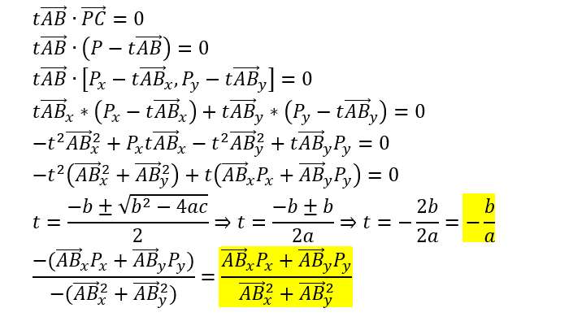

# Scalar Projection

This should be very easy to port to any programming language.  

The explanation is quite simple to understand.
The formula considers the triangle and line in the picture above.  

First of all, we consider P to be local to A.  

* tAB is a vector that points to the point C. We want to express that the dot product between this vector and PC vector is 0.  
* Algebraically we can continue until we get to a point where we can solve for t.  
* Once we solve for t, we plot in the rest of the equation, and we're left with a rather simple formula for the fraction of AB where AC lies.
* Profit.  